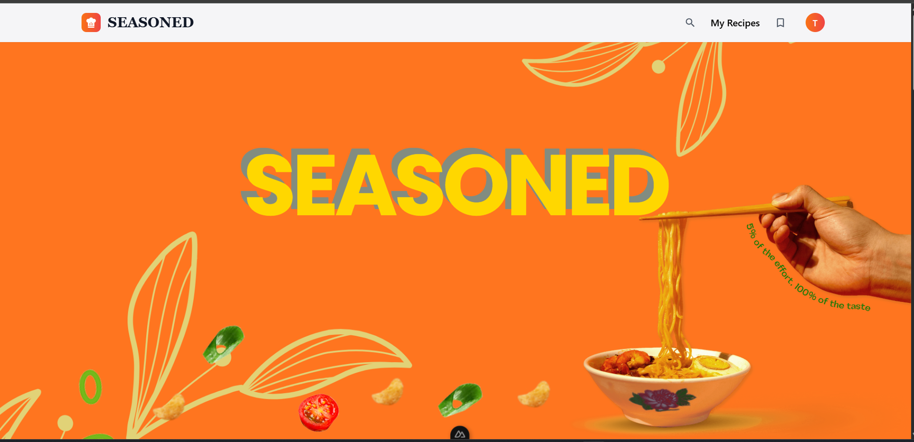

# Food Recipes Backend

This is the **backend** of the Food Recipes project, powered by **Hasura GraphQL Engine (Docker)**, **Postgres**, and **Golang** for custom actions.
It provides authentication, recipe management, and integrations (e.g., file uploads with supabase, payments with Chapa).

---

##  Tech Stack

* **Hasura GraphQL Engine** (running in Docker)
* **Postgres** (running in Docker)
* **Golang** (for Hasura Actions, custom business logic, and GraphQL client)
* **JWT Authentication**

---

## 🚀 Getting Started

### 1. Clone the repository

```bash
git clone https://github.com/Beth-ss/spatula.git
cd spatula/backend
```

### 2. Environment Variables

Create a `.env` file in the `backend/` directory:


### 3. Run Docker (Hasura + Postgres)

In the `backend/` folder, run:

```bash
docker compose up -d
```

This will start:

* **Postgres** (default port `5432`)
* **Hasura GraphQL Engine** (default port `8080`)

Access the Hasura Console at:
👉 [http://localhost:8080/console](http://localhost:8080/console)

### 4. Run the Go Backend

```bash
cd go-backend
go mod tidy
go run cmd/server/main.go
```


## 📚 Scripts

* `docker compose up -d` → start Hasura + Postgres
* `docker compose down` → stop containers
* `go run cmd/server/main.go` → run the Go backend

---


## 📸 Demo




## 🤝 Author

Developed by [Your Name]
